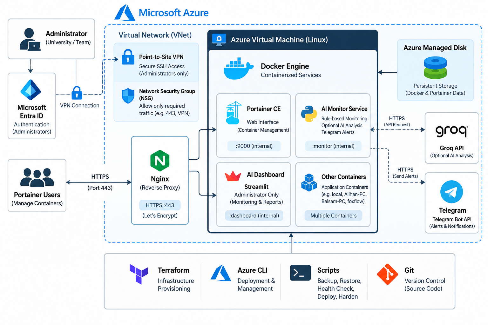

# Container Hub

A cloud-based container management platform built on **Microsoft Azure, Portainer, Docker, Terraform, and Python**.

Container Hub provides centralized container management, secure remote administration, persistent cloud storage, automated operational tools, and an administrator-only monitoring dashboard with optional AI-assisted analysis.

---

## Architecture



---

## Key Features

- Centralized Docker container management using **Portainer CE**
- Cloud infrastructure hosted on **Microsoft Azure**
- Infrastructure provisioning using **Terraform**
- Secure HTTPS access through **Nginx** and **Let's Encrypt**
- Infrastructure administrator authentication using **Microsoft Entra ID**
- Secure SSH administration through **Azure Point-to-Site VPN**
- Remote Docker host management using **Portainer Edge Agent**
- Persistent Docker and Portainer data using an **Azure Managed Disk**
- Backup, restore, deployment, health-check, and hardening scripts
- Administrator-only monitoring dashboard built with **Streamlit**
- Rule-based container monitoring and notifications
- Optional AI-assisted incident analysis using **Groq**
- Telegram alerts and notifications
- Configurable keep-running container recovery

---

## Platform Preview


---

## Project Architecture

Container Hub is deployed on an Azure Linux Virtual Machine running Docker.

**Portainer CE** provides the main container management interface.  
**Nginx** acts as the HTTPS reverse proxy, while Azure networking and security controls protect administrative access.

The monitoring component runs separately and provides:

- Container health monitoring
- Rule-based issue detection
- Operational notifications
- Telegram alerts
- Optional AI analysis
- Container lifecycle tracking
- Configurable recovery

The AI Dashboard is available to **administrators only**.

---

## Project Structure

```text
portainer-azure-project/
│
├── ai-monitor/              # Monitoring, alerts, recovery and AI integration
├── dashboard/               # Administrator Streamlit dashboard
├── demo/                    # Demo application
├── docs/                    # Documentation and architecture assets
├── scripts/                 # Deployment and operational scripts
├── terraform/               # Azure infrastructure as code
│
├── compose.yaml             # Main Container Hub stack
├── compose.dashboard.yaml   # Dashboard service
├── compose.monitor.yaml     # Monitoring service
├── compose.demo.yaml        # Demo environment
├── compose.validation.yaml  # Validation environment
│
├── .env.example
└── README.md
```

---

## Technology Stack

| Category | Technologies |
|---|---|
| Cloud | Microsoft Azure |
| Container Management | Portainer CE |
| Containers | Docker, Docker Compose |
| Infrastructure as Code | Terraform |
| Identity | Microsoft Entra ID |
| Secure Administration | Azure Point-to-Site VPN |
| Networking | Azure VNet, NSG |
| Reverse Proxy | Nginx |
| HTTPS | Let's Encrypt |
| Backend | Python |
| Dashboard | Streamlit |
| Database | SQLite |
| AI Analysis | Groq |
| Notifications | Telegram Bot API |
| Version Control | Git & GitHub |

---

## Security

The platform applies multiple security controls:

- HTTPS-only web access
- Nginx reverse proxy
- Portainer management interface is not directly exposed publicly
- Azure Network Security Group rules restrict inbound traffic
- SSH access is restricted to the Point-to-Site VPN network
- Microsoft Entra ID is used for infrastructure administrator authentication
- AI Dashboard access is restricted to administrators
- API keys and secrets are stored outside source control
- Terraform state and local configuration files are excluded from Git

---

## Getting Started

### 1. Clone the repository

```bash
git clone https://github.com/alfaifilena/portainer-azure-project.git
cd portainer-azure-project
```

### 2. Configure environment variables

Use:

```text
.env.example
```

as the configuration template.

Do not commit real passwords, API keys, private keys, or production credentials.

### 3. Provision Azure Infrastructure

```bash
cd terraform
terraform init
terraform plan
terraform apply
```

Use:

```text
terraform.tfvars.example
```

as a template for local Terraform configuration.

### 4. Start Container Hub

From the project root:

```bash
docker compose up -d
```

### 5. Start Monitoring

```bash
docker compose -f compose.monitor.yaml up -d --build
```

### 6. Start the AI Dashboard

```bash
docker compose -f compose.dashboard.yaml up -d --build
```

### 7. Verify Containers

```bash
docker ps
```

---

## Operational Scripts

Operational scripts are available under:

```text
scripts/
```

They include:

- Docker installation
- Azure managed disk setup
- Deployment
- Remote deployment
- Backup
- Restore
- Health checks
- System hardening
- Groq configuration
- Telegram configuration

---

## Persistent Storage

Container Hub uses an **Azure Managed Disk** for persistent Docker and Portainer data.

This allows application data to remain available independently of the operating system disk and supports recovery workflows.

---

## Monitoring and AI

The monitoring system does **not depend on AI** for normal operation.

Rule-based monitoring performs issue detection and notifications continuously.

AI analysis is optional and is only performed when explicitly requested by an administrator.

SQLite is used for runtime persistence of monitoring information, reports, notifications, and related operational records.

---

## Documentation

Detailed project documentation is available here:

- [Container Hub Documentation](docs/container-hub.md)
- [Container Hub Setup Guide](docs/container_hub_setup.md)
- [Integration Log](docs/integration-log.md)

---

## Known Limitations

- Some external networks may block or interfere with Portainer Edge Agent WebSocket traffic.
- AI analysis requires internet access and valid Groq credentials.
- Telegram alerts require valid Telegram Bot configuration.
- Current automatic recovery is designed for a single Docker host and does not provide multi-host failover.
- Backups stored on the same managed disk are not a replacement for an independent off-site backup.

---

## Project

**Container Hub**

SDA Bootcamp Capstone Project  
**Group 01**


