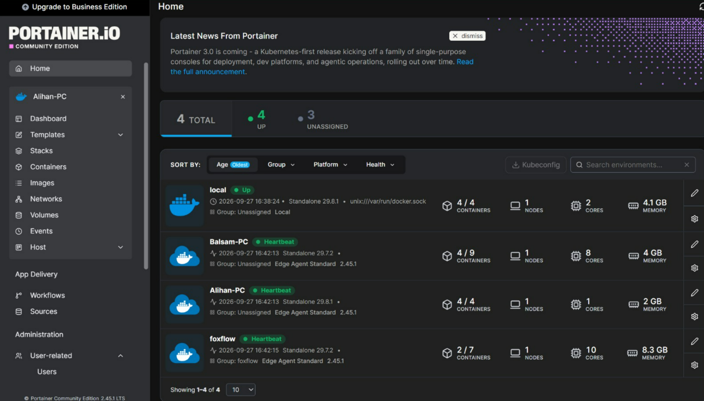
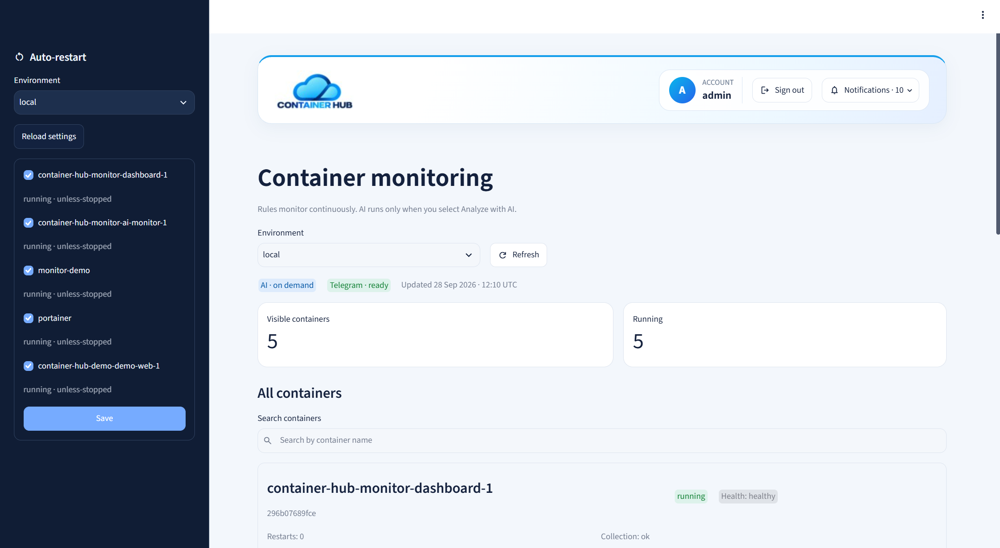

# Container Hub

## 1. Project Summary

**Container Hub** is a cloud-based container management platform built using Microsoft Azure, Portainer, Docker, Terraform, and Python.

The platform provides centralized Docker container management, secure remote administration, remote environment management, persistent cloud storage, automated operational tools, continuous monitoring, notifications, and an administrator-only AI monitoring dashboard.

### Portainer Container Management Interface



### AI Monitoring Dashboard



### Main Capabilities

- Centralized Docker container management using Portainer CE
- Remote Docker environment management using Portainer Edge Agent
- Microsoft Azure cloud infrastructure
- Infrastructure provisioning using Terraform
- Secure HTTPS access through Nginx and Let's Encrypt
- Microsoft Entra ID authentication for infrastructure administrators
- Azure Point-to-Site VPN for secure SSH administration
- Persistent storage using Azure Managed Disk
- Backup, restore, deployment, health-check, and hardening scripts
- Rule-based container monitoring
- Administrator-only AI monitoring dashboard
- Optional AI-assisted analysis using Groq
- Telegram alerts and notifications
- Configurable container recovery

---

## 2. Requirements

The following tools and services are required:

- Microsoft Azure subscription
- Docker Engine
- Docker Compose
- Portainer CE
- Terraform
- Azure CLI
- Git
- Python 3
- Nginx
- Microsoft Entra ID

Install the dashboard dependency using:

```bash
pip install -r dashboard/requirements.txt
```

Current Python dependency:

```text
streamlit==1.64.0
```

---

## 3. Installation

Clone the repository:

```bash
git clone https://github.com/alfaifilena/portainer-azure-project.git
cd portainer-azure-project
```

Configure Terraform:

```bash
cd terraform
terraform init
```

Use:

```text
terraform.tfvars.example
```

as a template for your local:

```text
terraform.tfvars
```

Then run:

```bash
terraform plan
terraform apply
```

Use `.env.example` as the template for application configuration.

Do not commit real passwords, API keys, private keys, or other secrets.

---

## 4. Run the Project

Start the main Container Hub stack:

```bash
docker compose up -d
```

Start the monitoring service:

```bash
docker compose -f compose.monitor.yaml up -d --build
```

Start the administrator AI dashboard:

```bash
docker compose -f compose.dashboard.yaml up -d --build
```

Verify running containers:

```bash
docker ps
```

Verify Docker Compose services:

```bash
docker compose ps
```

Portainer provides the main interface for container and environment management.

The AI monitoring dashboard is restricted to administrators.

---

## 5. API Keys & Environment Variables

Use `.env.example` as the configuration template.

Configuration may include:

- Portainer connection settings
- Groq API credentials
- Telegram Bot credentials
- Monitoring configuration
- Container recovery settings

Terraform-specific values should be stored locally in:

```text
terraform.tfvars
```

The following files must not be committed to Git:

```text
.env
terraform.tfvars
terraform.tfstate
terraform.tfstate.backup
.terraform/
*.tfplan
```

Only example files such as `.env.example` and `terraform.tfvars.example` should be included in source control.

The monitoring system uses SQLite for runtime persistence. The database is created automatically by the monitoring service and is not included as a project dataset.

---

## 6. Known Issues

- Some external networks may block or interfere with Portainer Edge Agent WebSocket traffic.
- AI-assisted analysis requires internet connectivity and valid Groq credentials.
- Telegram notifications require valid Telegram Bot configuration.
- Environment-specific values must be configured before deployment.
- The current automatic recovery mechanism is designed for a single Docker host and does not provide multi-host automatic failover.
- Backups stored on the same Azure Managed Disk support recovery but are not a replacement for an independent external backup.
