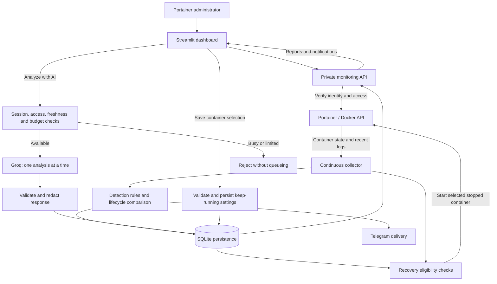

# AI Dashboard — System Overview and User Guide

**Project:** Container Hub  
**Document type:** Functional and operational reference  
**Last updated:** 28 September 2026  
**Audience:** New users, administrators, project reviewers, and maintainers

## 1. Purpose and scope

The AI Dashboard is the container monitoring and recovery workspace within Container
Hub. It provides a central interface for inspecting Docker containers managed through
Portainer, reviewing detected conditions, receiving notifications, requesting AI
explanations, and selecting containers that must remain running.

The system has four complementary functions:

| Function | Purpose | Execution model |
|---|---|---|
| Monitoring and detection | Collect container observations and identify supported conditions using predefined rules. | Continuous; independent of an open dashboard. |
| Notifications | Present rule findings and lifecycle changes in the dashboard and send configured Telegram alerts. | Triggered by observations; no AI request required. |
| AI analysis | Explain a selected container's recent observations and suggest diagnostic checks. | Requested explicitly through **Analyze with AI**. |
| Keep-running recovery | Start selected stopped containers, including containers stopped manually. | Based on saved administrator selections and the monitoring cycle. |

AI analysis is advisory. Recovery follows explicit saved settings and deterministic
state checks; an AI response does not authorize or execute container operations.
This deployment provides recovery within reachable Docker environments. It does not
provide automatic failover to another server when a host becomes unavailable.

### 1.1 Key terminology

| Term | Meaning in this system |
|---|---|
| Environment | A Docker endpoint registered in Portainer, such as the local VM or another supported Docker host. |
| Container state | Docker's execution status, such as running, exited, created, or restarting. |
| Health status | The result of a configured container healthcheck; separate from execution state. |
| Finding | A supported condition identified from Docker state or recent log evidence. |
| Lifecycle notification | A notification describing an observed stop or return to running. |
| Keep-running selection | A saved instruction for the monitor to start a particular container when eligible. |
| Monitoring sample | A bounded set of recent state and log observations, rather than a complete log archive. |

## 2. Architecture and processing flow

The interface is implemented in Streamlit. A private Python backend performs
collection, access checks, rule evaluation, AI request handling, recovery, and
notification processing. Portainer provides access to Docker environments. SQLite
stores the latest reports, notifications, delivery state, analysis records, usage
counters, lifecycle baselines, and keep-running selections.



### 2.1 Monitoring cycle

1. The collector obtains accessible supported environments using the monitoring
   service credential and verified HTTPS.
2. It collects container state, health, restart count, termination information,
   and bounded recent logs.
3. Rules evaluate supported state conditions and log signatures. Lifecycle
   comparison identifies changes relative to the previous stored observation.
4. Findings and notifications are persisted. Eligible alerts enter the Telegram
   delivery process.
5. The recovery component checks saved keep-running selections and starts eligible
   stopped containers. A return to running is reported after state verification.
6. The latest report is stored for authorized dashboard users.

Collection, Telegram delivery, and AI execution are separate activities. A provider
limit or an unavailable Telegram destination does not require monitoring to stop.
Environment collection failures are reported as failures rather than healthy results.

## 3. Access and getting started

### 3.1 Access requirements

- A reachable Container Hub dashboard and Portainer service.
- A Portainer administrator account. Non-administrator accounts are rejected.
- Access to the relevant Docker environment through Portainer.
- For automatic recovery, a monitoring service credential with permission to
  inspect and start containers in that environment.

The deployed dashboard is available at
[Container Hub AI Dashboard](https://portainer-container-hub.eastus.cloudapp.azure.com/ai/).
VM administration through Microsoft Entra ID is separate from dashboard sign-in.

### 3.2 First-use workflow

1. Open the dashboard and sign in with a Portainer administrator account.
2. Select an environment in the main monitoring view.
3. Confirm that the collection timestamp is recent and that collection succeeded.
4. Search for a container and review its state, health, restart count, and findings.
5. Expand its evidence and recent log sample when investigating a condition.
6. Review notifications and mark them as read when appropriate.
7. Select **Analyze with AI** when an explanation of a fresh sample is needed.
8. Configure the sidebar's **Auto-restart** selection for containers that should
   remain running, then select **Save**.

The main monitoring view and the Auto-restart sidebar have separate environment
selectors. Verify the environment shown in the sidebar before saving settings.

### 3.3 Sessions

The backend revalidates Portainer identity and permissions on authenticated
requests. A successful workspace refresh renews the session's activity window.
The current activity window is 45 seconds, and the absolute session duration is
limited to one hour or the Portainer token expiry, whichever occurs first.

Closing the dashboard, interrupted refreshes, sign-out, or an authorization change
can end the session. Continuous monitoring, notification delivery, and previously
saved keep-running selections do not depend on that user session remaining open.

## 4. Understanding the dashboard

| Element | Information or action |
|---|---|
| Environment selector | Chooses the environment displayed in the main monitoring view. |
| Refresh | Requests an updated view of the available monitoring report. It does not request AI analysis. |
| Collection timestamp | Indicates when the displayed observations were collected. |
| Container overview | Shows visible containers, running counts, and container-specific observations. |
| Search | Filters the displayed containers by name. |
| Container state and health | Distinguish process execution from configured healthcheck results. |
| Evidence and observations | Show detected conditions and the evidence supporting them. |
| Recent log sample | Provides a bounded, redacted sample for investigation. |
| Notifications | Displays rule and lifecycle notices with per-user read/unread state. |
| AI status and analysis result | Show availability, execution state, validated output, model, and generation time. |
| Telegram status | Indicates notification delivery readiness or configuration/connectivity issues. |
| Auto-restart sidebar | Loads environment-specific container selections and saves keep-running settings. |

A stale report describes an earlier observation. Partial collection means some
information was obtained but other observations were unavailable. Failed collection
means a usable current report could not be obtained. None of these states should
be interpreted as confirmation that an application is healthy.

## 5. Detection and notifications

### 5.1 Rule-based detection

Rules operate without contacting the AI provider. Each finding includes a category
and supporting evidence; the system does not assign severity or priority scores.

| Category group | Supported examples |
|---|---|
| Docker state | Failing healthcheck, restarting snapshot, recent Docker-reported OOM kill, abnormal termination, and dead state. |
| Connectivity | Connection refused, timeout, DNS failure, interrupted connection, address already in use, and TLS/certificate errors. |
| Resources and filesystem | Permission denied, missing path, read-only filesystem, storage exhaustion, and application memory exhaustion. |
| Application and configuration | Authentication failure, invalid or missing configuration, missing dependency/command, and application exceptions. |
| HTTP access logs | Recognized access-log responses with HTTP status 400–599. |

Findings identify observed evidence, not necessarily a root cause. For example,
HTTP 404 does not establish an outage, exit code 137 alone does not establish an
OOM kill, and a restarting snapshot does not establish a restart loop. A missing
healthcheck is not automatically an error. A clean stop can produce a lifecycle
notification without being classified as an abnormal-termination finding.

### 5.2 Lifecycle notifications

The monitor stores an initial baseline without reporting pre-existing stopped
containers as new stop events. Subsequent observed stops and returns generate
dashboard notifications and eligible Telegram alerts.

Changes in start timestamps and increases in Docker restart counts can reveal a
restart that occurred between collection samples. Multiple intermediate restarts
may be summarized. The displayed observation time is not a guaranteed exact event
time, and monitoring interruptions can result in missed intermediate events.

An unchanged observation does not repeatedly create the same lifecycle notice.
Persisted baselines preserve this behavior across monitor restarts.

### 5.3 Dashboard and Telegram delivery

Dashboard notifications are persistent and filtered by current container access.
Read/unread state is maintained per user. Marking notifications as read affects
the dashboard state; it does not retract a delivered Telegram message.

Telegram uses a configured private chat. Messages contain the environment,
container, observed condition, observation time, and concise evidence. Rule and
lifecycle alerts do not require an open dashboard or an AI request.

| Delivery control | Current behavior |
|---|---|
| Duplicate suppression | A 15-minute window for repeated matching rule/fact identities; distinct lifecycle transitions have their own identities. |
| Delivery processing | A separate worker checks for deliverable alerts approximately every 3 seconds. |
| Request timeout | 10 seconds per Telegram request. |
| Retry limit | Up to 3 attempts, with backoff and handling of provider Retry-After responses. |
| Alert lifetime | Pending alerts expire after 15 minutes. |
| Rejected configuration | Invalid credentials or a rejected destination require correction before normal delivery resumes. |

Network ambiguity can cause a duplicated delivery, and prolonged failures can
prevent delivery. Telegram is a notification channel, not a guaranteed event log.
An automatic-start failure also creates a dashboard notice for investigation.

## 6. AI analysis

### 6.1 Request workflow

AI is called only when an administrator selects **Analyze with AI** for a container.
Before dispatch, the backend checks the session, administrator role, container
access, sample freshness, provider availability, concurrency, and daily budgets.

The application permits one analysis at a time. If it is busy or in a cooldown,
the request is rejected immediately; it is not saved for later execution. Busy
and cooldown rejections do not consume an accepted-request budget. Accepted
requests count toward the application's budgets even if provider execution fails.

Reports must be recent and have usable container observations. The freshness limit
is 150 seconds, with a small clock-skew allowance. Refreshing the dashboard,
collecting reports, sending notifications, and performing recovery do not themselves
request AI analysis.

### 6.2 Provider and output

The current deployment uses **Groq**, configured with model
`openai/gpt-oss-20b`. The backend sends bounded, redacted observations and treats
container names and log contents as untrusted data.

The response must contain four validated text fields:

| Field | Purpose |
|---|---|
| Summary | Describe the observed situation. |
| Possible cause | Present a plausible explanation with appropriate uncertainty. |
| Suggested checks | Recommend diagnostic checks for an administrator. |
| Uncertainty | Identify missing evidence or limits of the explanation. |

The interface also displays the returned model and generation time. AI does not
execute commands, change restart settings, start containers, or send independent
AI-generated Telegram alerts. Administrators remain responsible for evaluating
its suggestions against application-specific evidence.

### 6.3 Limits and failures

Application budgets are currently 300 accepted AI requests globally and 10 per
user per UTC day. Provider quotas and availability are separate constraints.
Provider failures and cooldowns are presented to the user without automatically
retrying an AI request. Restarting the monitor does not replay interrupted analysis
work; a new request must be submitted when appropriate.

## 7. Automatic recovery: keeping selected containers running

### 7.1 Configuration procedure

1. In the **Auto-restart** sidebar, select the intended environment.
2. Review the container list and current settings. Use **Reload settings** to
   discard unsaved edits and load current values.
3. Check each container that must remain running. Uncheck containers that should
   be allowed to stay stopped.
4. Select **Save** and review the outcome for every affected container.

Changing a checkbox alone does not apply a setting. Saving persists the selection
for that environment and exact container ID. A partial failure does not undo
successful updates to other containers; reload settings to inspect the current state.

### 7.2 Resulting behavior

| Selection and state | Result after a successful Save |
|---|---|
| Checked and running | Docker restart protection is configured, and the monitor maintains the saved keep-running selection. |
| Checked and stopped | The monitor starts the eligible container on a subsequent collection cycle. |
| Checked and manually stopped later | The monitor starts it again when the stop is observed and recovery is eligible. |
| Unchecked and stopped | The monitor leaves it stopped. |
| Unchecked and running | Saving does not stop it; it may subsequently be stopped without monitor-driven recovery. |

**To keep a container stopped, uncheck it and Save before stopping it.**

On first use after the keep-running upgrade, existing native restart policies may
appear as checked boxes. Save once to establish the explicit monitor-managed
selection. A native Docker restart policy alone does not authorize this monitor
to start a stopped container.

### 7.3 Recovery mechanism and boundaries

Selected containers use Docker's `unless-stopped` restart policy. In addition,
the monitor starts explicitly selected containers in `exited` or `created` state,
including those stopped manually. Unchecked containers use native policy `no`.
Saving also normalizes other checked native policies to `unless-stopped`.

Recovery runs within the collection cycle, normally about every 30 seconds plus
collection time. Slow or unreachable environments can extend that interval. Start
attempts have a 30-second per-container backoff, and a return is reported only after
inspection confirms the container is running.

- Swarm-managed tasks must be configured through their service.
- Paused, dead, or unknown-state containers are not automatically started by this
  recovery component.
- A native restart policy disabled outside the dashboard prevents monitor-driven
  starts until the configuration is corrected.
- Container recreation changes its ID. Select and save the replacement container;
  also maintain the intended native policy in its Compose or Stack definition.
- The monitor must remain running. It cannot recover itself after being manually
  stopped or restart containers on an unavailable host.
- A running process with an unhealthy healthcheck is not restarted solely because
  its healthcheck fails.

## 8. Functional requirements

| ID | Capability | Implemented behavior |
|---|---|---|
| FR-01 | Administrator access | Authenticate with Portainer and reject non-admin accounts. |
| FR-02 | Environment isolation | Filter environments, reports, notifications, and actions using current access checks. |
| FR-03 | Continuous collection | Monitor supported Docker environments independently of dashboard sessions. |
| FR-04 | Container inspection | Display state, health, restarts, freshness, findings, and recent evidence. |
| FR-05 | Deterministic detection | Evaluate supported state conditions and log signatures without AI. |
| FR-06 | Lifecycle tracking | Detect observed stops and returns, including evidence of rapid restarts between samples. |
| FR-07 | Persistent notifications | Maintain rule/lifecycle notices and per-user read state. |
| FR-08 | Telegram delivery | Deliver configured rule and lifecycle alerts with suppression and bounded retries. |
| FR-09 | Explicit AI analysis | Accept analysis only after a user action and successful admission checks. |
| FR-10 | Immediate admission | Admit one AI analysis at a time or reject without queueing. |
| FR-11 | Structured explanation | Validate and display summary, possible cause, suggested checks, and uncertainty. |
| FR-12 | AI budgets and cooldowns | Enforce application limits and persist provider-related cooldown state. |
| FR-13 | Environment-specific recovery settings | Present container checkboxes with explicit Save and Reload actions. |
| FR-14 | Manual-stop recovery | Start eligible containers covered by a persisted keep-running selection. |
| FR-15 | Recovery controls | Recheck live state, serialize Save/start decisions, back off retries, and report failed starts. |
| FR-16 | Operational persistence | Preserve selections and lifecycle baselines across monitor restarts; do not replay interrupted AI jobs. |

## 9. Non-functional requirements

| ID | Attribute | Implementation and scope |
|---|---|---|
| NFR-01 | Access control | Administrator-only sign-in and repeated identity/environment/container authorization checks. |
| NFR-02 | Transport and credentials | Verified HTTPS to Portainer; private backend networking; secrets stored outside source control. |
| NFR-03 | Privacy | Bounded, redacted observations; no Docker environment-variable collection. Redaction is best-effort. |
| NFR-04 | Reliability | Separate monitoring, Telegram processing, and AI execution; persistent state and explicit failure reporting. |
| NFR-05 | Responsiveness | Periodic collection and UI refresh; configured intervals are not response-time guarantees. |
| NFR-06 | Resource control | Bounded logs, provider responses, AI concurrency, usage budgets, and retained historical records. |
| NFR-07 | Recovery safety | Persisted container-ID selections, live eligibility checks, per-container backoff, and a shared Save/recovery lock. |
| NFR-08 | Maintainability | Separate UI, API, collection, rules, lifecycle, recovery, storage, provider, and notification modules. |
| NFR-09 | Observability | Report collection status, provider/delivery status, evidence, timestamps, and recovery failures. |
| NFR-10 | Deployment | Docker Compose services with health checks and persistent monitoring data. A single VM remains a failure boundary. |

## 10. Configuration and operational reference

### 10.1 Current deployment settings

These values describe the repository configuration dated above, not an external
service guarantee. They should be reviewed whenever configuration changes.

| Setting | Current value |
|---|---|
| Collection interval | 30 seconds, plus collection duration. |
| Main dashboard refresh | 10 seconds. |
| Recent log limit | Up to 100 lines per container. |
| Log observation window | 300 seconds. |
| AI provider/model | Groq / `openai/gpt-oss-20b`. |
| Concurrent AI analyses | 1. |
| Global/per-user AI budgets | 300 / 10 accepted requests per UTC day. |
| AI request timeout | 60 seconds. |
| Historical record retention | 30 days for notices, completed analysis records, and delivery/usage history under the relevant pruning rules. |
| Keep-running state | Persisted by environment and container ID; independent of dashboard sessions. |
| Restart-attempt backoff | 30 seconds per selected container. |

### 10.2 Components and locations

| Component | Source or deployment location |
|---|---|
| Dashboard interface | `dashboard/app.py` |
| Authentication and private API | `ai-monitor/report_api.py` |
| Portainer transport | `ai-monitor/portainer.py` |
| Collection and orchestration | `ai-monitor/monitor.py`, `ai-monitor/run_monitor.py` |
| Detection and redaction | `ai-monitor/rules.py` |
| Lifecycle comparison | `ai-monitor/lifecycle.py` |
| Keep-running settings and recovery | `ai-monitor/restart_control.py` |
| Persistence | `ai-monitor/storage.py` |
| AI provider integration | `ai-monitor/ai_client.py` |
| Telegram processing | `ai-monitor/telegram_alerts.py` |
| Deployment configuration | `compose.monitor.yaml`, `compose.dashboard.yaml` |
| Deployed source | `/srv/portainer-data/monitor-app` |
| Persistent monitor data | `/srv/portainer-data/ai-monitor` |
| Secret-file directory | `/srv/portainer-data/config/secrets` |

The dashboard binds to localhost port 8501 on the VM and is exposed through the
HTTPS reverse proxy at `/ai/`. The backend uses port 8090 inside the monitoring
network. Credential values must not be placed in documentation, logs, or Git.

Settings changes use the signed-in administrator's Portainer credentials. Background
collection and recovery use the service credential; recovery requires permission to
start the selected container. AI and Telegram have separate provider credentials.

### 10.3 Routine administration

To inspect the deployment without changing it:

```bash
cd /srv/portainer-data/monitor-app
sudo docker compose -f compose.monitor.yaml -f compose.dashboard.yaml ps
```

Health checks verify service responsiveness. They do not establish that every
Portainer environment is reachable, every application is healthy, or every external
notification/provider request will succeed.

## 11. Troubleshooting

| Symptom | Interpretation and next action |
|---|---|
| Sign-in rejected | Confirm that the account is a Portainer administrator and Portainer is reachable. |
| Session expired | Sign in again; interrupted background refreshes can end the activity window. |
| No containers in an environment | Confirm the selected environment, current access, and collection configuration. |
| Stale, partial, or failed collection | Check environment connectivity and monitoring service permissions before relying on displayed values. |
| AI unavailable or busy | Read the reported status; wait for the active request/cooldown to end and submit again if needed. No request is queued. |
| Telegram unavailable | Check configured credentials, private destination, network access, and reported delivery state. |
| Checkbox changed but behavior unchanged | Select Save; review per-container errors and Reload settings to confirm the persisted result. |
| Checked container remains stopped | Confirm Save completed, the monitor is running, a collection cycle has elapsed, and the service credential can start it. Inspect any automatic-start failure notice. |
| Container returns after manual Stop | This is expected for a saved keep-running selection. Uncheck and Save before stopping it again. |
| Recreated container no longer recovers | Select and save the new container ID. |
| Container is running but unhealthy | Review healthcheck evidence; keep-running recovery does not repair an unhealthy running process. |

## 12. Demonstration and verification

### 12.1 Introductory demonstration

The optional `monitor-demo` container provides an isolated HTTP-error demonstration.
Its endpoint is bound to localhost on the VM. If it is installed and running:

1. Select the VM environment and locate `monitor-demo` in the dashboard.
2. From the VM, request `curl -i http://127.0.0.1:18080/error` to generate an
   intentional HTTP 500 response and matching log evidence.
3. After collection and refresh, inspect the HTTP finding and its evidence.
4. Review the corresponding Telegram alert when delivery is available.
5. Optionally select **Analyze with AI** to demonstrate a real provider request;
   present the actual returned result or availability message.

This HTTP response demonstrates rule detection and delivery, not a container crash.
For a recovery demonstration, use a disposable non-production container, save its
keep-running selection, stop it manually, and observe its return. Disable its
selection before leaving it stopped or removing it.

### 12.2 Verification record

The following records distinguish controlled tests from live deployment checks.
They describe completed checks and do not represent a new full-system certification.

| Area | Recorded evidence |
|---|---|
| Original monitoring workflow | Earlier backend/UI tests covered access checks, explicit AI requests, busy rejection, budgets, sessions, rule matching, and Telegram handling. |
| Live rule notification | An isolated demo HTTP 500 was detected and Telegram previously confirmed delivery without an AI request. |
| Restart settings and lifecycle | Focused tests covered scoped/partial saves, initial stopped baselines, rapid-restart detection, and duplicate suppression. |
| Keep-running update | Three focused backend tests and one UI interaction test passed for selection persistence, manual-stop recovery, disabling, retry backoff, and explicit Save behavior. |
| Live manual-stop recovery | A disposable container was manually stopped on the VM, recovered through the Portainer service API, verified as running, and removed after the check. |
| Deployment health | The updated monitor and dashboard passed Docker health checks. |
| Latest caption change | Python syntax and Git whitespace checks passed; the rebuilt dashboard passed its health check. |

Mocked AI tests verify application behavior and response validation; they do not
establish current live Groq availability. Recovery checks do not establish server
failover, recovery performance at scale, or guaranteed notification delivery.

## 13. Operational limits

The dashboard provides recent observations rather than exhaustive log retention,
complete application tracing, or guaranteed detection of every failure. AI output
is explanatory and may be incomplete. Telegram depends on external delivery.
Recovery is limited to saved selections, eligible container states, reachable
Docker environments, and an operational monitoring service.

Within those boundaries, the dashboard combines continuous evidence collection,
administrator-requested explanations, lifecycle notifications, and explicit
container recovery controls in one operational workspace.
