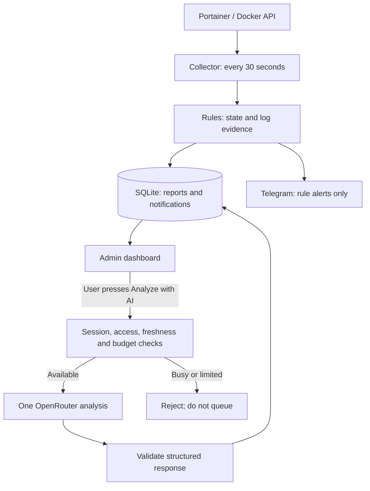

# AI Monitor & Alerts

## What we proposed and built

AI Monitor & Alerts is a container monitoring feature for the Container Hub project.
It combines continuous rule-based detection, a web dashboard, private Telegram alerts,
and optional AI explanations requested by an administrator.

The problem was that automatic AI analysis consumed the free provider's quota and
left users waiting in an analysis queue. The revised design makes monitoring independent
of AI: rules identify supported evidence continuously, Telegram delivers rule alerts,
and AI is contacted only when the administrator presses **Analyze with AI**.

The implementation removes automatic AI detection, its scheduling interval, its queue
worker, and its old UI indicators. It keeps one immediate analysis at a time. A busy or
rate-limited service rejects a new request with a clear message instead of saving it
for execution later. No paid-model fallback or automatic remediation was introduced.

**Verification status (27 September 2026):** deployed to the VM. The monitor,
dashboard and persistent demo container passed Docker health checks. All 27 backend
tests passed on the VM and 4 dashboard tests passed locally. A real demo HTTP 500
was detected by rules and Telegram confirmed delivery. The global AI usage counter
stayed at 103 during that test. No new backup was created, as requested.

## How it works

1. The collector reads accessible Docker environments through the Portainer API every
   30 seconds, using the existing monitoring service credential and verified HTTPS.
2. For each container, it collects state, health, restart count, termination information,
   and up to 100 recent log lines within a five-minute window.
3. Deterministic rules classify supported Docker states and log signatures. Findings
   include the matched category and evidence; reports and notifications are stored in SQLite.
4. The dashboard refreshes every 10 seconds. Only Portainer administrators can sign in,
   and the backend rechecks identity and environment/container permissions on requests.
5. Current rule findings can create Telegram alerts independently of dashboard sessions.
   Duplicate observations are suppressed for 15 minutes. Telegram delivery failures
   do not trigger AI and do not stop normal collection.
6. Pressing **Analyze with AI** requests an explanation of a fresh container sample.
   The backend checks availability, session permissions and daily budgets, starts one
   analysis immediately, and returns a job ID so the UI can poll for the result.
7. The AI receives bounded, redacted observations and returns a validated structured
   response: summary, possible cause, suggested checks and uncertainty. It cannot
   execute commands or modify containers.

## Functional requirements

| ID | Capability | Implemented behavior |
|---|---|---|
| FR-01 | Administrator sign-in and sign-out | Authenticate through Portainer; reject non-admin accounts; revoke local sessions on sign-out. |
| FR-02 | Environment and container access | List supported environments and filter reports/jobs/notifications using current Portainer permissions. |
| FR-03 | Continuous collection | Collect independently of an open dashboard or active admin session. |
| FR-04 | Container overview | Display state, health, restarts, collection status, freshness and searchable container names. |
| FR-05 | Rule-based detection | Identify the supported conditions listed below and show evidence rather than asserting an unproven root cause. |
| FR-06 | Evidence inspection | Show rule findings, recent log samples and partial/failed collection indicators. |
| FR-07 | Persistent notifications | Keep rule notifications and per-user read/unread state; support marking visible notifications as read. |
| FR-08 | Telegram alerts | Send all current rule categories, including HTTP 4xx/5xx, to one configured private chat. No AI-generated alerts or normal-status messages. |
| FR-09 | Duplicate suppression | Persist a 15-minute suppression window keyed by environment, container, rule and facts such as HTTP status. |
| FR-10 | Optional AI analysis | Send a provider request only after an explicit button action, with fresh data, an authorized session and available budgets. |
| FR-11 | Immediate admission or rejection | Run one analysis at a time; reject busy/cooldown requests without queueing them or consuming their request budgets. |
| FR-12 | AI result presentation | Display summary, possible cause, suggested checks, uncertainty, model and generation time. |
| FR-13 | Limits and provider errors | Maintain global and per-user daily limits; persist cooldowns and show readable failures without automatic AI retries. |
| FR-14 | Session and restart handling | Expire inactive sessions; revalidate access before dispatch; interrupt legacy queued/running jobs after restart rather than replaying them. |
| FR-15 | Telegram setup | Accept the bot token through hidden terminal input, verify a private Start challenge, and store credentials in root-only secret files. |

### Supported rule categories

- Docker state: unhealthy healthcheck, restarting snapshot, recent OOM kill, and
  abnormal termination/dead state.
- Connectivity: connection refused, timeout, DNS failure, interrupted connection,
  address already in use, and TLS/certificate errors.
- Resources and files: permission denied, missing path, read-only filesystem,
  storage exhaustion, and application memory exhaustion.
- Application/configuration: authentication failure, invalid or missing configuration,
  missing dependency/command, and application exceptions.
- HTTP access logs: responses with status 400–599.

A restarting snapshot is not proof of a restart loop; HTTP 404 is not proof of an outage;
exit 137 alone is not proof of OOM. A clean stop or missing healthcheck is not automatically
classified as an error. Rules do not guarantee 100% detection or zero false positives.

## Non-functional requirements

| ID | Quality attribute | Mechanism and practical limitation |
|---|---|---|
| NFR-01 | Security and access control | Admin-only access, repeated Portainer authorization checks, verified TLS, private backend API, and secrets outside Git. These controls are not a security certification. |
| NFR-02 | Privacy | Bound and redact log samples; exclude Docker environment variables; keep credentials out of provider payloads and application logs. Redaction is best-effort, not a guarantee for every application-specific secret. |
| NFR-03 | Reliability | Separate collection, Telegram delivery and AI execution; persist reports, limits and notification state; mark interrupted work on restart. A single VM remains a single point of failure. |
| NFR-04 | Responsiveness | Refresh the dashboard every 10 seconds; collect every 30 seconds; run AI in a separate thread so the UI can continue updating. These are configured intervals, not guaranteed response-time SLAs. |
| NFR-05 | Bounded resource use | Limit samples, provider response size and concurrent AI execution; retain monitoring data for 30 days. No claim of unlimited scale is made. |
| NFR-06 | Cost control | No background AI calls; free-model configuration; atomic daily budgets of 300 accepted requests globally and 10 per user in this deployment. Provider limits are separate. |
| NFR-07 | Delivery resilience | Telegram uses a 10-second timeout, up to three attempts, retry-after/backoff and a 15-minute alert lifetime. Delivery after an ambiguous timeout can duplicate a message; exactly-once delivery is not guaranteed. |
| NFR-08 | Maintainability and testability | Separate collection, rules, storage, API, AI client, Telegram and UI modules; automated tests use controlled provider responses and temporary databases. |
| NFR-09 | Deployability and recovery | Docker Compose deployment, health checks, persistent data volume, a source-hash guard before replacing VM files. |
| NFR-10 | Transparency | Show actual collection/provider status and advisory uncertainty; never present a cached or fabricated answer as a newly completed live AI request. |

## Results and outcomes verified so far

- **31 automated tests passed:** 27 backend tests and 4 Streamlit dashboard tests.
- Opening and refreshing reports, collecting data, and running Telegram delivery
  created **zero AI requests** in controlled tests.
- Explicit analysis started a running job and returned a validated result using a mock provider.
- Two simultaneous requests admitted one analysis and rejected the other; the rejected
  request created no additional job and did not consume the daily budgets.
- Tests confirmed logout, expired sessions, changed roles, revoked container access,
  permission outages and stale data can prevent provider dispatch.
- Cooldowns and longer Retry-After values were respected without automatic AI retries.
- Telegram tests confirmed rule-only delivery, redaction, restart-safe deduplication,
  bounded retries and continued collection during delivery failures.
- UI tests confirmed sign-in/out, no analysis during refresh, explicit button submission,
  clear busy rejection and disabled analysis for failed collection.
- UTF-8 decoding and Python syntax checks passed for the prepared files.

Live checks confirmed healthy deployed containers, collection of the local Docker
environment, detection of an intentional HTTP 500 and accepted Telegram delivery.
The demo remains installed for recording; see [Demo recording](demo-recording.md).
Some other configured environments remain unreachable; their failed collection is
reported separately. Live OpenRouter availability and production performance have
not been verified. No AI request was made during deployment or the live rule test.

## Short presentation explanation

> We proposed and implemented a container monitoring system that uses deterministic
> rules for continuous detection, Telegram for private error alerts, and AI for optional
> explanations. Portainer supplies the container data, SQLite preserves reports and
> notifications, and a Streamlit dashboard lets administrators inspect evidence and
> request analysis. AI runs only when the Analyze button is pressed, so monitoring
> remains useful even when the free AI provider is unavailable. Automated tests verify
> access control, no background AI requests, immediate busy rejection and reliable
> alert deduplication. Deployment and live delivery verification are reported separately
> rather than assumed from the test results.
