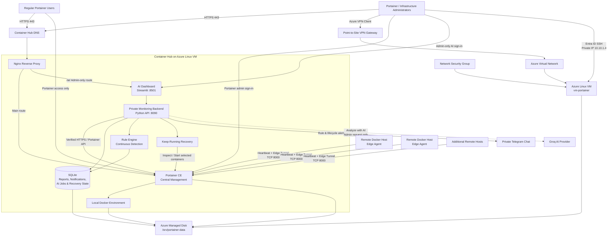

# Container Hub — Portainer Platform

## Table of Contents

- [What we proposed and built](#what-we-proposed-and-built)
- [How it works](#how-it-works)
- [High-level architecture](#high-level-architecture)
- [Azure infrastructure](#azure-infrastructure)
- [Portainer deployment](#portainer-deployment)
- [Docker environment management](#docker-environment-management)
  - [Local environment](#local-environment)
  - [Remote environments](#remote-environments)
- [AI monitoring, alerts and recovery](#ai-monitoring-alerts-and-recovery)
  - [Continuous monitoring and rules](#continuous-monitoring-and-rules)
  - [Telegram notifications](#telegram-notifications)
  - [Optional AI analysis](#optional-ai-analysis)
  - [Keep-running recovery](#keep-running-recovery)
  - [AI deployment components](#ai-deployment-components)
- [User access model](#user-access-model)
  - [Portainer users](#portainer-users)
  - [Administrators](#administrators)
- [Network security](#network-security)
- [HTTPS and reverse proxy](#https-and-reverse-proxy)
- [Persistent storage](#persistent-storage)
- [Backup and recovery](#backup-and-recovery)
- [Functional requirements](#functional-requirements)
- [Non-functional requirements](#non-functional-requirements)
- [Verification and outcomes](#verification-and-outcomes)
- [Operational notes](#operational-notes)
- [Demo recording](#demo-recording)
- [Short presentation explanation](#short-presentation-explanation)
- [Project responsibility areas](#project-responsibility-areas)
- [Scope and limitations](#scope-and-limitations)

---

## What we proposed and built

Container Hub is a centralized container management platform built around **Portainer Community Edition**, **Docker**, and **Microsoft Azure**.

Portainer is the management tool used in the solution; our work focused on designing, deploying, securing, connecting, and operating the complete environment around it.

The platform was deployed on an Azure Linux virtual machine and connected to the local Docker environment. Remote Docker hosts were added through **Portainer Edge Agent Standard**, allowing multiple Docker environments to be managed from one interface.

The solution also includes:

- Infrastructure as Code using **Terraform**
- A dedicated **Azure Managed Disk** for persistent Docker and Portainer data
- **Nginx** as a reverse proxy
- **HTTPS** access through the project DNS name
- **Microsoft Entra ID** and **Point-to-Site VPN** for administrator SSH access
- Portainer local users and teams for end-user access
- Backup, restore, health-check, deployment, and disk-setup scripts
- Recovery testing using the persistent data disk
- An **AI Dashboard** at `/ai/` for container monitoring, rule-based detection, Telegram alerts, optional administrator-requested AI explanations, and explicit keep-running recovery controls

**Platform URL**

`https://portainer-container-hub.eastus.cloudapp.azure.com`

---

## How it works

1. Users open the Container Hub URL over HTTPS.
2. Nginx receives the HTTPS request and forwards Portainer traffic internally to Portainer on `127.0.0.1:9443`.
3. Portainer manages the local Docker environment running on the Azure VM.
4. Remote Docker hosts connect to the central Portainer server using **Edge Agent Standard**.
5. The Edge Agent maintains a heartbeat with Portainer and uses the Edge tunnel on TCP port `8000` when interactive access is required.
6. Portainer administrators assign environments and resources to local Portainer users or teams.
7. Docker and Portainer persistent data is stored on a separate Azure Managed Disk.
8. Infrastructure administrators connect to the Azure virtual network through the Point-to-Site VPN and use Microsoft Entra ID for SSH authentication to the VM private IP.
9. Backup, restore, and health-check scripts support routine operations and recovery.
10. The **AI Dashboard** is exposed through the existing HTTPS site at `/ai/`, but access is restricted to **Portainer administrators only**.
11. Regular Portainer users use the main Container Hub / Portainer interface and do **not** have access to the AI Dashboard.
12. A private monitoring backend collects supported container state and recent log observations from Portainer, evaluates deterministic rules, and stores reports and notifications in SQLite.
13. Rule findings can create dashboard and Telegram notifications without contacting the AI provider.
14. AI analysis runs only when an administrator explicitly selects **Analyze with AI**; the result is advisory and does not execute container operations.
15. Saved keep-running selections allow the monitor to start eligible stopped containers during the monitoring cycle.

---

## High-level architecture

### Graphical architecture



### Architecture explanation

- **Regular Portainer users** access only the main Container Hub / Portainer interface according to their assigned Portainer permissions.
- **The AI Dashboard is restricted to Portainer administrators only.** Standard users do not have access to `/ai/`.
- **Nginx** is the public HTTPS entry point. It routes the main site to Portainer and the admin-only `/ai/` path to the Streamlit AI Dashboard.
- **Portainer** is the central management layer for the local Azure VM Docker engine and remote Docker hosts connected through Edge Agent.
- A **private Python backend** performs monitoring collection, authorization checks, rule evaluation, AI request handling, notification processing, and recovery logic.
- **SQLite** persists monitoring reports, notifications, AI records, usage counters, lifecycle baselines, and keep-running selections.
- **Rule detection and Telegram alerts do not require AI**.
- **Groq is contacted only when a Portainer administrator explicitly requests AI analysis**.
- **Keep-running recovery** follows saved administrator settings and deterministic state checks; AI does not authorize or execute recovery actions.
- **Azure Managed Disk** stores the persistent Container Hub and monitoring data.
- **Infrastructure administrators** reach the VM through Point-to-Site VPN and Microsoft Entra ID SSH.


---

## Azure infrastructure

The Azure environment is defined with Terraform.

### Main resources

- Resource Group: `rg-portainer`
- Virtual Network: `vnet-portainer`
- VM subnet: `10.10.1.0/24`
- Gateway subnet: `10.10.2.0/27`
- Linux Virtual Machine: `vm-portainer`
- VM private IP: `10.10.1.4`
- Public IP and DNS name for the public web endpoint
- Network Security Group
- Azure Managed Disk: `disk-portainer-data`
- Point-to-Site VPN Gateway
- Microsoft Entra ID group for administrators

### Terraform structure

Important Terraform files include:

- `main.tf`
- `variables.tf`
- `outputs.tf`
- `versions.tf`
- `entra.tf`
- `vpn.tf`

Terraform keeps the cloud configuration reproducible and version-controlled.

---

## Portainer deployment

Portainer runs as a Docker container on the Azure Linux VM.

The Portainer management endpoint is bound locally to:

```text
127.0.0.1:9443
```

Nginx provides the public HTTPS endpoint.

Portainer also exposes:

```text
8000/tcp
```

for the Edge Agent tunnel.

The deployment uses the Portainer Community Edition LTS image.

---

## Docker environment management

### Local environment

The Azure VM is registered as the local Docker environment.

From Portainer, administrators can manage:

- Containers
- Images
- Volumes
- Networks
- Stacks
- Logs
- Container lifecycle actions
- Health and runtime status

### Remote environments

Remote Docker hosts are connected using **Portainer Edge Agent Standard**.

This allows remote devices behind NAT or normal home networks to connect outward to the central Portainer server instead of exposing the normal Portainer Agent port on every remote host.

The Edge Agent uses:

- Portainer API communication
- TCP port `8000` for the Edge tunnel
- Docker socket access on the remote host

---

## AI monitoring, alerts and recovery

The **AI Dashboard** is the monitoring and recovery workspace inside Container Hub. It complements Portainer by providing recent container observations, rule-based findings, notifications, optional AI explanations, and explicit keep-running controls.

It is available through the existing Container Hub HTTPS endpoint at:

```text
https://portainer-container-hub.eastus.cloudapp.azure.com/ai/
```

Only **Portainer administrator accounts** can sign in to the AI Dashboard. Standard Portainer users do not have AI Dashboard access. VM administration through Microsoft Entra ID remains separate from dashboard authentication.

### Core functions

| Function | Purpose | Execution model |
|---|---|---|
| Monitoring and detection | Collect container observations and identify supported conditions using predefined rules. | Continuous and independent of an open dashboard. |
| Notifications | Present rule/lifecycle findings and send configured Telegram alerts. | Triggered by observations; no AI request required. |
| AI analysis | Explain a selected container's recent observations and suggest diagnostic checks. | Runs only after **Analyze with AI** is selected. |
| Keep-running recovery | Start explicitly selected eligible stopped containers. | Uses saved administrator selections during the monitoring cycle. |

### Continuous monitoring and rules

The monitoring service collects supported Docker observations through the Portainer API. Current deployment behavior includes:

- Collection approximately every **30 seconds**, plus collection duration.
- Container state, health, restart count, termination information, and bounded recent logs.
- Up to **100 recent log lines** per container within a **five-minute observation window**.
- Deterministic rule matching without contacting the AI provider.
- Persistent reports and notifications stored in SQLite.

Supported observations include Docker state problems, connectivity errors, filesystem/resource errors, application/configuration errors, and recognized HTTP access-log responses from `400` to `599`.

A finding represents observed evidence, not a guaranteed root cause. For example, an HTTP 404 does not by itself prove an outage, and exit code 137 alone does not prove an OOM event.

### Telegram notifications

Rule findings and lifecycle changes can be sent to one configured private Telegram chat.

Telegram delivery:

- Works independently of AI.
- Does not require the dashboard to remain open.
- Includes concise, redacted evidence.
- Suppresses repeated matching rule/fact identities for **15 minutes**.
- Uses bounded retries and delivery timeouts.
- Does not act as a guaranteed event log.

### Optional AI analysis

AI is **not** used for continuous detection.

An AI provider request starts only when an administrator explicitly selects **Analyze with AI** for a container.

Before dispatch, the backend checks:

- Current administrator session
- Portainer role and container access
- Freshness of the collected sample
- Provider availability
- Concurrency
- Daily application budgets

The current deployment permits **one AI analysis at a time**. Busy or cooldown requests are rejected immediately rather than queued.

The current provider configuration is:

```text
Provider: Groq
Model: openai/gpt-oss-20b
```

The AI receives bounded, redacted observations and returns a structured advisory result containing:

- Summary
- Possible cause
- Suggested checks
- Uncertainty
- Model and generation time

AI output is advisory only. It cannot execute commands, change container settings, start containers, or independently create AI-generated Telegram alerts.

### Keep-running recovery

Administrators can select containers that should remain running.

The recovery feature:

- Saves selections by environment and exact container ID.
- Uses Docker `unless-stopped` for selected containers.
- Starts eligible selected containers observed in `exited` or `created` state.
- Rechecks state before reporting recovery.
- Uses a per-container retry backoff.
- Leaves unchecked containers stopped.
- Does not automatically start paused, dead, or unknown-state containers.
- Does not provide host failover if the Docker host itself is unavailable.

To intentionally keep a selected container stopped, the administrator should uncheck it and save the setting before stopping it.

### AI deployment components

| Component | Role |
|---|---|
| Streamlit Dashboard | Administrator interface exposed through `/ai/`. |
| Private Python Backend | Authentication checks, collection, rules, AI dispatch, recovery, and notification processing. |
| Portainer API | Source of accessible Docker environments and container operations. |
| SQLite | Persistent reports, notifications, analysis records, counters, baselines, and keep-running selections. |
| Telegram Bot | Private rule and lifecycle notification channel. |
| Groq | Optional administrator-requested AI explanation provider. |
| Azure Managed Disk | Persistent storage for monitoring data and deployed source. |

The dashboard binds to localhost port `8501` on the VM and is published through the existing HTTPS reverse proxy. The private backend uses port `8090` inside the monitoring network; no new public backend API port is required.


---

## User access model

Container Hub uses two access models.

### Portainer users

Regular Container Hub users are created as local Portainer users.

They do not need Azure VPN access or Microsoft Entra ID, and they **do not have access to the AI Dashboard**.

Their access is limited to the Portainer environments and resources assigned to them.

Access can be assigned to:

- Individual users
- Portainer teams
- Specific environments
- Specific resources

A Standard User sees resources that are public or assigned to that user/team.

### Administrators

Administrators have two separate privileged access paths:

- **Portainer administrator access** for the main Portainer interface and the admin-only AI Dashboard.
- **Infrastructure administrator access** through Microsoft Entra ID and the Azure Point-to-Site VPN for VM administration.

The administrator group is:

```text
Portainer-Admins
```

Administrators connect to the VPN first, then access the VM using Entra ID SSH authentication.

Example:

```powershell
az ssh vm --resource-group rg-portainer --name vm-portainer --prefer-private-ip
```

Public SSH access was removed after VPN access was successfully validated.

---

## Network security

| Port | Purpose |
|---|---|
| 80 | HTTP / redirect and web support |
| 443 | HTTPS access to Container Hub |
| 8000 | Portainer Edge Agent tunnel |
| 22 | SSH from the Point-to-Site VPN address pool only |

SSH is restricted to the Point-to-Site VPN client range:

```text
172.16.100.0/24
```

Portainer port `9443` is bound only to localhost and is not directly exposed to the Internet.

---

## HTTPS and reverse proxy

Nginx is installed on the Azure VM and acts as a reverse proxy in front of Portainer.

Public traffic arrives using the project DNS name and HTTPS.

Nginx forwards Portainer requests internally to:

```text
https://127.0.0.1:9443
```

TLS certificates are managed with Let's Encrypt / Certbot.

The same reverse proxy also exposes the **AI Dashboard** at `/ai/`, while its backend remains private inside the monitoring network.

---

## Persistent storage

Container Hub uses a separate **Azure Managed Disk** for persistent application data.

The disk is mounted at:

```text
/srv/portainer-data
```

Docker and containerd persistent directories are stored on the data disk through bind mounts.

This separates persistent Docker and Portainer data from the VM operating system disk.

### Why this matters

If the VM needs to be recreated, the same managed disk can be attached to the replacement VM and the persistent Portainer and Docker data can be reused.

The managed disk provides **persistent storage and recovery support**. It is not, by itself, an independent backup.

---

## Backup and recovery

Important operational scripts include:

```text
backup.sh
restore.sh
health.sh
data-disk-setup.sh
docker-install.sh
deploy.sh
remote-deploy.sh
operate.sh
harden.sh
init.sh
```

### Backup

`backup.sh` creates an application-level archive containing important Portainer configuration and data.

### Restore

`restore.sh` supports restoration of Portainer data from a generated backup archive.

### Health checks

`health.sh` validates important platform components such as Docker, Portainer, storage, and service availability.

### Recovery validation

Recovery was tested using a replacement VM and the existing Azure Managed Disk.

After the persistent disk was attached and the services were started, the same Portainer instance data was recovered successfully.

---

## Functional requirements

| ID | Capability | Implemented behavior |
|---|---|---|
| FR-01 | Centralized container management | Manage Docker environments through one Portainer interface. |
| FR-02 | Local Docker management | Manage the Docker engine running on the Azure VM. |
| FR-03 | Remote environment management | Connect remote Docker hosts using Portainer Edge Agent Standard. |
| FR-04 | Container lifecycle control | View, start, stop, restart, inspect, and monitor containers. |
| FR-05 | Docker resource visibility | View images, volumes, networks, stacks, and logs. |
| FR-06 | User access control | Assign environments and resources to Portainer users or teams. |
| FR-07 | Secure web access | Access Container Hub through HTTPS using Nginx as a reverse proxy. |
| FR-08 | Persistent data | Store Docker and Portainer data on an Azure Managed Disk. |
| FR-09 | Backup and restore | Create and restore application-level Portainer backups. |
| FR-10 | Health validation | Run platform health checks through operational scripts. |
| FR-11 | Secure administrator access | Use Point-to-Site VPN and Microsoft Entra ID for VM administration. |
| FR-12 | Infrastructure as Code | Provision and manage Azure infrastructure through Terraform. |
| FR-13 | Recovery | Reattach the persistent disk to a replacement VM and recover Portainer data. |
| FR-14 | DNS access | Provide a stable Azure DNS name for the web platform. |
| FR-15 | Version control | Store infrastructure and operational source files in GitHub. |
| FR-16 | Continuous monitoring | Collect supported Docker observations independently of an open AI Dashboard session. |
| FR-17 | Rule-based detection and notifications | Detect supported conditions and persist dashboard/Telegram notifications without AI. |
| FR-18 | Optional AI analysis | Start AI analysis only after an explicit administrator request and successful admission checks. |
| FR-19 | Keep-running recovery | Persist administrator selections and start eligible selected stopped containers. |
| FR-20 | AI access control | Allow AI Dashboard access only to Portainer administrators; reject standard Portainer users and revalidate current administrator permissions on protected requests. |

---

## Non-functional requirements

| ID | Quality attribute | Mechanism and practical limitation |
|---|---|---|
| NFR-01 | Security | HTTPS, Nginx reverse proxy, VPN-only SSH, Entra ID authentication, NSG rules, and Portainer access control. |
| NFR-02 | Availability | Docker restart policies and health checks help keep services available; the current design still uses a single Azure VM. |
| NFR-03 | Persistence | Docker and Portainer data is stored on a separate Azure Managed Disk. |
| NFR-04 | Recoverability | Managed-disk recovery and application-level backup/restore procedures are available. |
| NFR-05 | Maintainability | Infrastructure is separated into Terraform files and operational scripts. |
| NFR-06 | Reproducibility | Terraform defines the Azure infrastructure as code. |
| NFR-07 | Remote manageability | Edge Agent allows central management of remote Docker hosts. |
| NFR-08 | Least exposure | Portainer `9443` is not publicly exposed; SSH is limited to the VPN client network. |
| NFR-09 | Auditability | Git tracks infrastructure and operational changes. |
| NFR-10 | Usability | Portainer provides a graphical interface for container operations. |
| NFR-11 | AI cost control | Continuous monitoring does not call AI; AI is administrator-requested with concurrency and daily application budgets. |
| NFR-12 | Monitoring privacy | AI and alerts use bounded/redacted observations; Docker environment variables are excluded from collection. |
| NFR-13 | Monitoring separation | Collection, Telegram delivery, AI execution, and recovery are separated so one external dependency does not automatically stop normal monitoring. |

---

## Verification and outcomes

The following parts of Container Hub were validated during implementation:

- Terraform configuration validated successfully.
- Azure infrastructure deployed successfully.
- Portainer runs successfully on the Azure Linux VM.
- Nginx reverse proxy provides access to Portainer through the project DNS name.
- HTTPS certificate is valid.
- Local Docker resources are visible through Portainer.
- Remote Edge Agent environments can send heartbeat information to Portainer.
- Edge Agent tunnel access on TCP port `8000` was verified.
- Remote Docker containers were successfully visible and manageable after tunnel connectivity was validated.
- Portainer user/team access was tested.
- Azure Managed Disk persistence was validated.
- Backup creation was tested.
- Recovery to a replacement VM using the same managed disk was tested successfully.
- Microsoft Entra ID SSH login was tested successfully.
- Point-to-Site VPN connectivity to the VM private IP was tested successfully.
- A second administrator successfully connected through VPN and Entra ID.
- Public SSH access was removed after the private administrator path was validated.
- Terraform and project changes were committed and pushed to GitHub.
- The deployed monitoring service and AI Dashboard passed Docker health checks.
- An isolated demo HTTP 500 was detected by the rule engine and a Telegram alert was previously confirmed without requiring an AI request.
- Focused tests covered keep-running selection persistence, manual-stop recovery, disabling, retry backoff, and explicit Save behavior.
- A disposable container was manually stopped, recovered through the Portainer service API, verified as running, and removed after the live recovery check.
- AI tests validate application behavior and structured responses with controlled provider behavior; they do not guarantee current live provider availability.

---

## Operational notes

### Administrator SSH

1. Connect using Azure VPN Client.
2. Confirm access to the VM private IP:

```powershell
Test-NetConnection 10.10.1.4 -Port 22
```

3. Connect using Entra ID:

```powershell
az ssh vm --resource-group rg-portainer --name vm-portainer --prefer-private-ip
```

### Remote Edge Agent troubleshooting

If a remote environment shows a heartbeat but containers cannot be opened:

```bash
docker logs portainer_edge_agent --tail 50
```

Test Edge tunnel reachability:

```bash
nc -vz portainer-container-hub.eastus.cloudapp.azure.com 8000
```

or:

```bash
curl -v --max-time 10 http://portainer-container-hub.eastus.cloudapp.azure.com:8000/
```

Basic TCP/HTTP reachability does not guarantee that every remote network will allow the WebSocket/Edge tunnel correctly.

---

## Demo recording

For a short Container Hub demonstration:

1. Open the Container Hub URL.
2. Show the Portainer home page.
3. Open the local environment.
4. Open the Containers page and show running/stopped containers.
5. Demonstrate container status and available lifecycle actions.
6. Show a connected remote environment through Edge Agent.
7. Show the Azure Managed Disk used for persistent data.
8. Briefly show the backup, restore, and health-check scripts.
9. Explain that administrators use VPN + Entra ID for secure VM access.
10. Sign in with a **Portainer administrator account**, open the **AI Dashboard** at `/ai/`, and show current container monitoring data. Standard users should not be used for this step because they do not have AI Dashboard access.
11. If demonstrating detection, use the isolated `monitor-demo` HTTP error endpoint and show the resulting rule evidence and Telegram notification.
12. Optionally select **Analyze with AI** once and present the actual provider result or availability message.
13. For recovery, use a disposable non-production container with a saved keep-running selection, stop it manually, and show that it returns after the monitoring cycle.

The AI demonstration should clearly distinguish **rule detection**, **Telegram delivery**, **AI explanation**, and **keep-running recovery** as separate functions.

---

## Short presentation explanation

> Container Hub is a centralized Docker management platform built using Portainer on Microsoft Azure. Portainer is the core management tool, while our work focused on deploying and integrating the full environment around it. We provisioned the Azure infrastructure using Terraform, deployed Portainer on a Linux VM, connected local and remote Docker environments, secured the web interface with Nginx and HTTPS, and restricted administrator SSH access through Point-to-Site VPN and Microsoft Entra ID. We also added persistent storage, backup and recovery support, and an **administrator-only AI Dashboard** as an operational extension. Regular users remain in the main Portainer interface, while Portainer administrators can use the AI Dashboard for continuous rule-based monitoring, Telegram alerts, optional administrator-requested AI explanations, and recovery of explicitly selected stopped containers. This keeps Portainer as the central control plane while adding monitoring, notifications, explanations, and recovery in one Container Hub platform.


---

## Project responsibility areas

### Cloud Infrastructure & DevOps

- Terraform
- Azure Virtual Machine
- Virtual Network and subnets
- Network Security Group
- Azure Managed Disk
- Azure VPN Gateway
- Git and GitHub

### Container Platform

- Docker
- Portainer
- Portainer Edge Agent
- Local and remote Docker environments
- Container lifecycle management

### Security

- Nginx reverse proxy
- HTTPS / TLS
- Microsoft Entra ID
- Point-to-Site VPN
- VPN-only administrator SSH
- Portainer user and team permissions

### Automation & Operations

- Backup scripts
- Restore scripts
- Health checks
- Data-disk initialization
- Docker installation
- Deployment and remote-deployment scripts

### AI Monitoring & Recovery

- Streamlit AI Dashboard
- Continuous container observation through Portainer
- Deterministic rule-based findings
- Telegram rule and lifecycle notifications
- Administrator-requested Groq analysis
- SQLite monitoring persistence
- Keep-running container recovery controls

---

## Scope and limitations

- Portainer itself is an existing product; the project contribution is the Azure deployment, integration, security, storage, automation, and remote-management design around it.
- The current platform is hosted on one Azure VM, so it is not a highly available multi-node control plane.
- The Azure Managed Disk provides persistence and recovery support, but it should not be described as an independent off-site backup.
- Edge Agent connectivity depends on the remote host network allowing the required outbound communication and tunnel traffic.
- Portainer Community Edition has fewer role-based access-control options than the Business Edition.
- Container Hub does not automatically guarantee application availability; it provides the tools to manage, monitor, recover, and operate the Docker environments.
- The AI Dashboard provides recent bounded observations rather than exhaustive application tracing or guaranteed detection of every failure.
- AI output is advisory and can be incomplete; it never authorizes container operations.
- Telegram delivery and live AI availability depend on external services.
- Keep-running recovery works only for saved eligible containers on reachable Docker hosts; it is not host failover.
